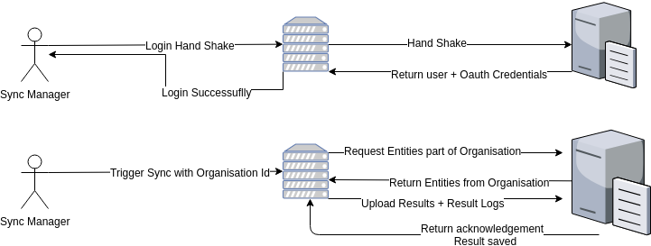

## Synchronisation and Encryption

### Synchronisation
The synchronization process is based upon two actors, the Client Server, which is installed on a Virtual Machine, and the Central Server.

#### Setting up the Client Server
The following script needs to be run on a TAO instance in order to create a Client Server.

```php
sudo -u www-data php index.php '\oat\taoOffline\scripts\tools\setup\SetupClientServer'
```

On systems where [extension-tao-encryption](https://github.com/oat-sa/extension-tao-encryption) is installed, the script will set it up with encryption.
    
Point the instance to a specific server by executing the following command:
 
 ```php
sudo -u www-data php index.php '\oat\taoSync\scripts\tool\RegisterHandShakeRootURL' --rootUrl=http://tao-central.dev/
 ```

#### Setting up the Central Server
Run the following to turn a TAO instance into a Central Server.

```php
sudo -u www-data php index.php 'oat\taoOffline\scripts\tools\setup\SetupCentralServer'
```

Again, instances with `taoEncryption` will benefit from encryption.

#### Types of available synchrounizations
* Test Center Based on the `OrganisationId`
    * Users:
        * Test Takers
        * Proctor Administrators
        * Proctor
        * Eligibility
        * Deliveries
* Results   
* Result Logs


#### Overview of the workflow


##### Sequence Diagram


#### Synchronizing users with encryption
Every user has been assigned an `application ID` that is used to grant access to the delivery content. Properties that are excluded from the synchronization process can be found under `excludedProperties` in the configuration file `config/taoSync/syncService.conf.php`.  Properties that are encrypted are defined inside `config/taoEncryption/encryptUserSyncFormatter.conf.php`.


#### Synchronizing deliveries with encryption
During the synchronization of the deliveries, the test package is sent to the client. The client then imports the test and generates a delivery. 

_Note: If you are synchronizing a delivery that already exists on the VM a new import of the test will be created._


##### Synchronizing results with encryption
The `chunkSize` of a result is an essential configuration parameter that needs to be set in advance; the default is `10`. It can be set depending on the number of variables included in a result.

If you have, for example, a test with 100 items (which means about 400 variables), the total request will contain about 4000 variables. This scenario is likely to overload the server. In this case, reducing the `chunkSize` to a smaller value is advised.

The statuses of a result that needs to be sent can be configured under `statusExecutionsToSync` in `config/taoSync/resultService.conf.php`. Each request to the server will include the number of results. The process will stop after all results have been sent.


#### Synchronizing results - Logs
Each result log is synchronized with the Central Server to maintain a history of the test. The number of logs sent per request is defined in the configuration inside `config/taoSync/SyncDeliveryLogService.conf.php`.
