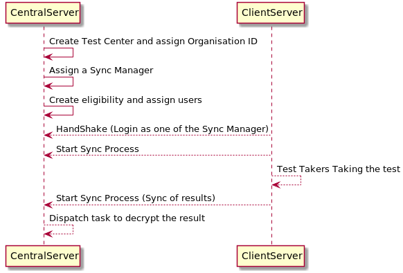
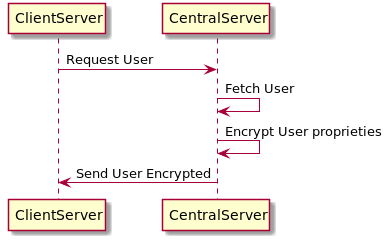
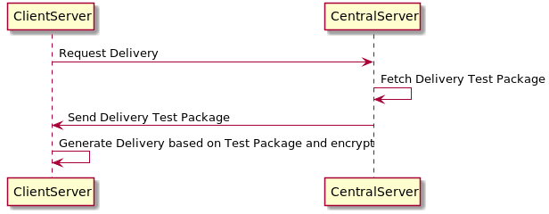
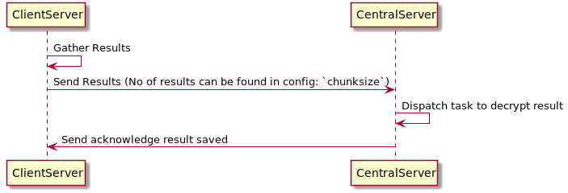

## Synchronisation & Encryption
#### Synchronisation
The sync process consists in having two actors, one is the ClientServer, which exists on a Virtual Machine and the second one being the CentralServer.

##### Setup ClientServer
The fallowing script needs to be run on TAO instance in order to make a client server.

```php
sudo -u www-data php index.php '\oat\taoOffline\scripts\tools\setup\SetupClientServer'
```
    In case taoEncryption it's installed this script it's gonna setup the instance with encryption.
    
 In order to point this instance to a specific server the fallowing command needs to be run
 
 ```php
    sudo -u www-data php index.php '\oat\taoSync\scripts\tool\RegisterHandShakeRootURL' --rootUrl=http://tao-central.dev/
 ```
 
 
##### Setup CentralServer
The fallowing script needs to be run on TAO instance in order to make a central server.

```php
sudo -u www-data php index.php 'oat\taoOffline\scripts\tools\setup\SetupCentralServer'
```
     In case taoEncryption it's installed this script it's gonna setup the instance with encryption.

##### Types of Syncs available
* Test Center Based on OrganisationId
    * Users:
        * Test Takers
        * Proctor Administrators
        * Proctor
        * Eligibility
        * Deliveries
 * Results   
 * Results Logs


##### Overview Flow


##### Sync Users with encryption
Each users has assign to him the application id in order to have access to the delivery content.
The properties that be excluded in the process of sync can be found in the `excludedProperties` in the config
`config/taoSync/syncService.conf.php`
In terms of encryption the properties that be encrypted are determined in `config/taoEncryption/encryptUserSyncFormatter.conf.php`




##### Sync Deliveries with encryption
On each delivery sync the test package it's send to the client, the client it's importing the test and generating a delivery. 
_Note_: 
> In a case that we are syncing a delivery already existing on the VM a new import of the test will exist.



###### Sync Results with encryption
The results chunkSize it's a very important config that needs to be set in advance, by default it's 10. Based on the number of variables exists in a results this can be set.
For example if you have a test of 100 items this will mean ~400 variables the total request will contain 4000 variables which will overload the server. In this case reducing the chunkSize to less it's adviced.

The statuses of a result which needs be sent can be configurable in the same config `statusExecutionsToSync`
The config can be found in `config/taoSync/resultService.conf.php`
Each request to the server will include the no of results, the process will stop after all results are sent.



##### Sync Results Logs
Each result log are synced to the central server in order to have a history of the test.
The number of logs sent in one request it's determined in the config of `config/taoSync/SyncDeliveryLogService.conf.php`


